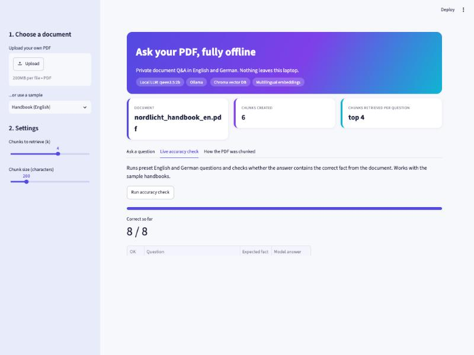
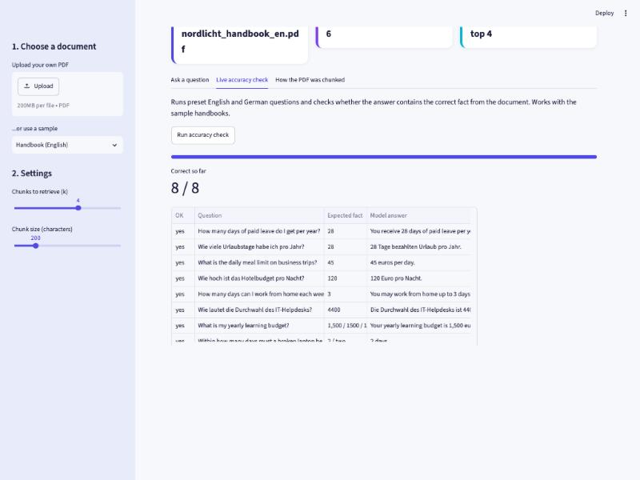

# Local RAG App with Streamlit

Ask questions about a PDF in English or German, fully offline. A small open-source language model runs on your own machine through Ollama, so no internet connection and no API key are needed after the one-time setup.





## How it works

1. **Load:** read the PDF (`pypdf`).
2. **Chunk:** split it into 200-character pieces (LangChain text splitter).
3. **Embed:** turn each chunk into numbers with a multilingual embedding model, so a German question can find an English chunk.
4. **Store:** keep the vectors in Chroma.
5. **Retrieve:** find the top-k chunks closest to the question (cosine similarity).
6. **Generate:** `qwen3.5:2b` answers using only those chunks and streams the answer into the page.
7. **Evaluate:** a built-in check runs 8 English and German questions and shows how many answers contain the correct fact.

## Features

- Upload your own PDF or use the sample company handbooks (English and German).
- Answers stream live and appear in the language of the question.
- Every answer shows its source chunks with similarity scores.
- A tab shows how the PDF was chunked.
- A live accuracy check with a pass count (8/8 on the sample handbook).

## Run it

```bash
ollama pull qwen3.5:2b      # one-time, 2.7 GB
uv sync
uv run streamlit run app.py
```

Requires Python 3.13 and [Ollama](https://ollama.com). The embedding model (about 470 MB) downloads automatically on the first run; after that everything works offline.

## Files

| File | Purpose |
|---|---|
| `app.py` | Streamlit front end |
| `rag.py` | RAG pipeline: load, chunk, embed, store, retrieve, generate, evaluate |
| `eval_set.json` | Questions and expected facts for the accuracy check |
| `make_sample_pdfs.py` | Generates the fictional sample handbooks in `documents/` |

## Limits

A 2B model is small: it follows simple factual questions well but can slip on nuance. The accuracy check uses simple keyword matching, so it is a quick signal, not a full evaluation.
